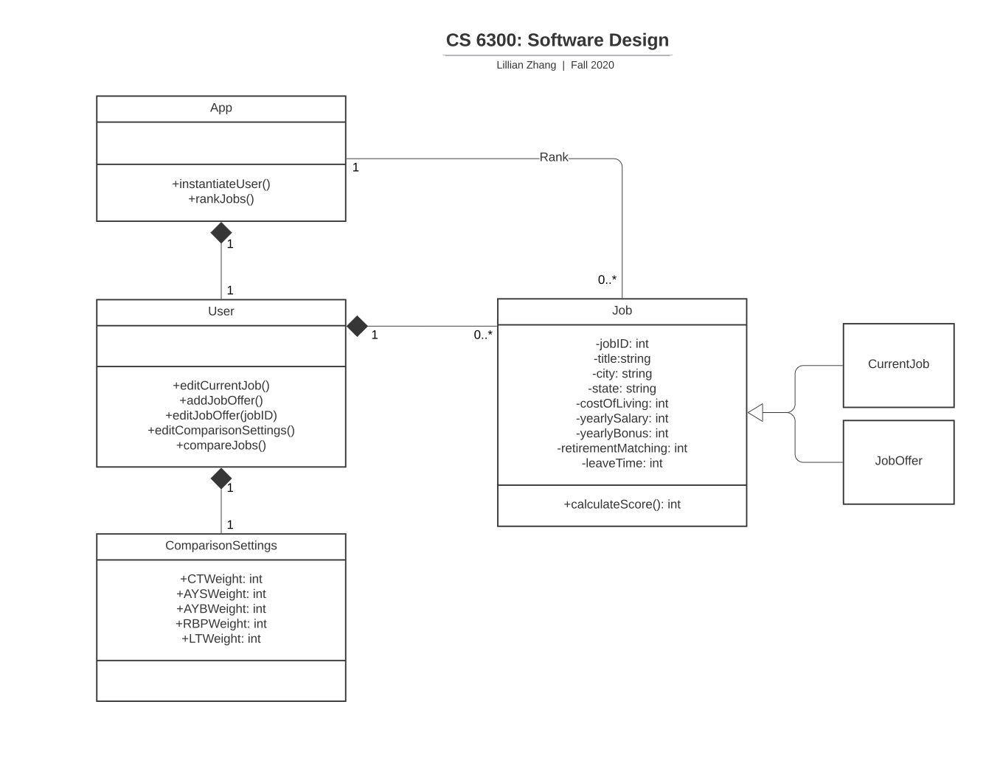
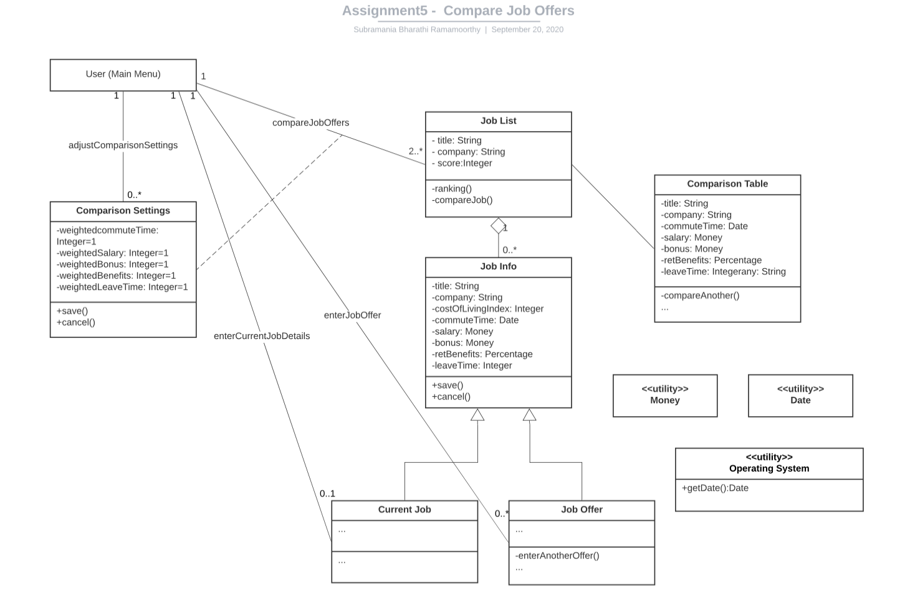
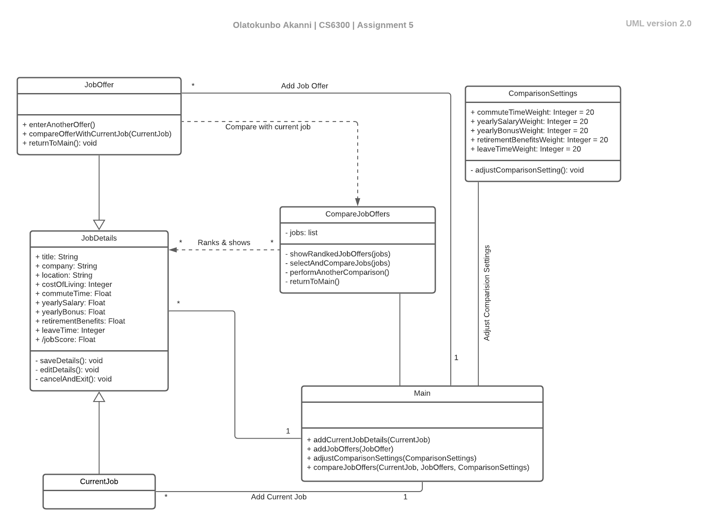
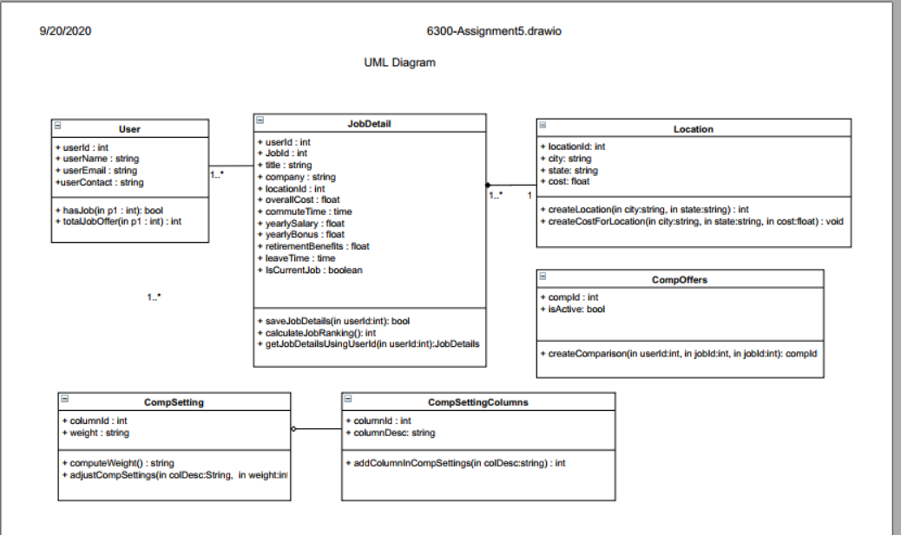
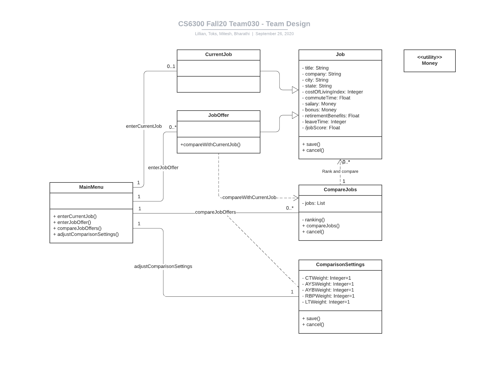

# Design Discussion for JobCompare App
## Design 1

### Pros
* The design includes the main menu (User) which interfaces with the GUI and the required operations.
* Job, ComparisonSettings, CurrentJob, JobOffer classes are all in line with the requirements.
* Cardinality in the relationships between the UML classes provided.
* Job and ComparisonSettings class has all the required attributes.
* CurrentJob and JobOffer classes are types (is a kind of) of Job class as described in the requirements.
* User class contains the 4 main operations of the app.
* Clean overall design.
* Correctly provided multiplicity between classes

### Cons
* No initial (default) values set for ComparisonSettings attributes.
* Some of the attributes in Job should be float/double, not integer.
* The requirement is for a single user, hence the ‘App’ class need not be there. User can be renamed to MainMenu.
* Comparison of the job, needs a class on its own, that is not part of the design.
* enterCurrentJobDetails, enter job offers, adjust the comparison settings, or compare job offers are interactions between the classes. Because these operations do not belong to only one class, instead they are a relationship between the classes. So they can be labeled on the association lines.
* Rank should not be a relationship between Job and App class.
* calculateScore() operation needs to know about the comparisonSettings values.

## Design 2
### Bharathi's Design

### Pros
* Job list class is separated out from Job info class, making it more clearer.
* Job offer has its own class with enterAnotherOffer() is a good idea, separating out the differences between job offers and current job.
* ComparisonSetting is set with relationship with User as well as a relationship association with compareJobOffers.
* The design includes the main menu (User)which interfaces with the GUI.
* JobInfo, ComparisonSettings, CurrentJob, JobOffer classes are all in line with the requirements.
* The use of utility classes for Money and Date, and using Money and Date as data types.
* Cardinality in class relationships are provided.
* Descriptive text of relationships provided.
* Attributes in JobInfo and ComparisonSettings(with default values)included.
* Save and Cancel methods are captured correctly.
* Dependencies and associations are captured correctly.

### Cons
* User should be same as main menu, should be identified as the entry point to the system
* Cardinality between JobList and JobInfo should be 1 to 1.
* Class name should be a string with consecutive letters without spaces or special characters, e.g: JobList (not Job List).
* score in JobList is a calculated attribute and should be identified with a backslash
* Operations in MainMenu should be called out.
* Location attribute in JobInfo should be in the form of state and city.
* Job List should not be separate class. It is list of jobs object with ranking. It should be part of ComparisonTable class.
* Usage of utility class for Date and Operating System is not clear.
* Salary and Bonus attribute can be treated as a float instead of creating Money utility class.

## Design 3
### Toks' Design

### Pros
* The design includes the MainMenu which interfaces with the GUI.
* Main Menu class contains all the 4 main operations of the app.
* Design includes all required classes: JobDetails, ComparisonSettings, CurrentJobOffers, CurrentJob, JobOffer. Does not have any extraneous classes.
* Simple and clean design overall.
* Attributes in JobInfo and ComparisonSettings (with default values) included.
* Descriptive text included for relationships.
* Relationships cardinality included.
* Default value for all attributes in ComparisonSettings class.
* CurrentJob and JobOffer are subclasses of JobDetails class as described in the requirements.
* CompareJobOffers class has the list of all the jobs as per the requirements.
* CompareJobOffers class correctly shows the dependency association with the JobDetails class.

### Cons
* Incorrect cardinality: CurrentJob cannot be more than 1 job and the cardinality should reflect this as [0..1].
* CompareJobOffers uses ComparisonSettings to rank jobs but this is not shown in the design.
* saveDetails() and cancelAndExit() should not be methods in the jobDetails class, they are implemented via the GUI instead since the job itself would not save/cancel.
* All three operations in JobOffer are not needed.
* Location (JobDetails attribute) not split into state and city  per requirements.
* enterCurrentJobDetails, enter job offers, adjust the comparison settings, or compare job offers are interactions between the classes. Because these operations do not belong to only one class, instead they are a relationship between the classes. So they can be labeled on the association lines.
* performAnotherComparison(), enterAnotherOffer() operations are already defined in the design in other classes, so they need not be specified again.
* editDetails() need not be a separate operation, as the fields can be open to edit and save() would take care of storing the edited fields.
* Wrongfully depicted relationship between CurrentJob and Main as many to 1.

## Design 4
### Mitesh's Desgin

### Pros
* Design includes all required classes: JobDetails, ComparisonSettings, CurrentJobOffers, User.
* JobDetails covers all the attributes.
* Included relationships and its cardinality.
* Created generic method for the weights. One can create as many weight attributes with its weightage as required.

###Cons
* Missed relationship description between classes.
* Unnecessary class creation: Location class.
* Better to create JobDetails as a base class.
* CurrentJob and JobOffers should be include as derived classes from JobDetails.
* There is no requirement for User class and methods hasJob() and totalJobOffer().
* Missing save(), cancel() and/or returnToMain() methods.
* Should have included default values for the ComparisonSettings class.
* No need of compId attribute in CompOffers class.

## Team Design

### General classes
The main commonalities between the team design and the individual designs are the existence of the four main classes: MainMenu, CurrentJob, JobOffer, and ComparisonSettings. These were the classes that were explicitly stated in the requirements along with a set of necessary attributes (such as company name and location). While UML designs may vary from team to team or iteration to iteration, these four classes are the key actors in the system and each class's attributes and methods should remain relatively consistent through various designs.
### Job Inheritance
We decided to have the CurrentJob and JobOffer classes inherit the general Job class. This is largely because a current job and a job offer differs only in that there can be a maximum of one current job at any time whereas a user can enter multiple job offers and the user has the option to compare any job offer with the current job (if present) upon creating a new job offer. Other than these, the attributes of both classes are the same and thus, should not be implemented more than once to avoid redundancy. The Job inheritance is common among all but one of the individual designs.
### Comparing Jobs
The way we designed the flow to compare jobs is mostly adopted from Bharathi's and Tok's designs. Our UML diagram includes a separate CompareJobs class that consists of a list which tracks and ranks current job and job offers. The "compare jobs" action can be called from the main menu and from the "add job offer" screen so there is a "compareJobOffers" and "compareWithCurrentJob" relationship connecting those classes respectively. The importance of this class is to satisfy the requirements of ranking and displaying jobs selected by the user for comparison. The ComparisonSettings is then associated with the compareJobOffers relationship because it is used to weight certain factors for score calculation prior to ranking and comparing.
### Utilities
In contrast to all of our individual designs, the team design has only one utility class which is the money class. This utility will be used to answer the monetary compensation fields for the current job or a job offer. All other attributes of the Job class can be completed with other datatypes. 

## Summary
In this assignment, as a team we are able to discuss individual take on designing an application. It reflected the views on many design methodologies used by an individual.  
We had detailed discussion on pros and cons of each team member's design. This project has provided us the opportunity to iron out the flaws in our own design and understand the requirements better.
We were actually able to do requirement elicitation through our discussion. We were able to discuss the different aspects of UML diagrams - finalizing class diagram and their attributes, methods within a class, relationships and its cardinality.
As a team, after finalizing the class diagram, we mapped the requirement with our diagram to identify any requirement missed  or have any extra class or attributes or operations.  

Overall this team project has provided us an opportunity to get hands on experience on requirement elicitation, application design and how to represent the application using class diagram.
