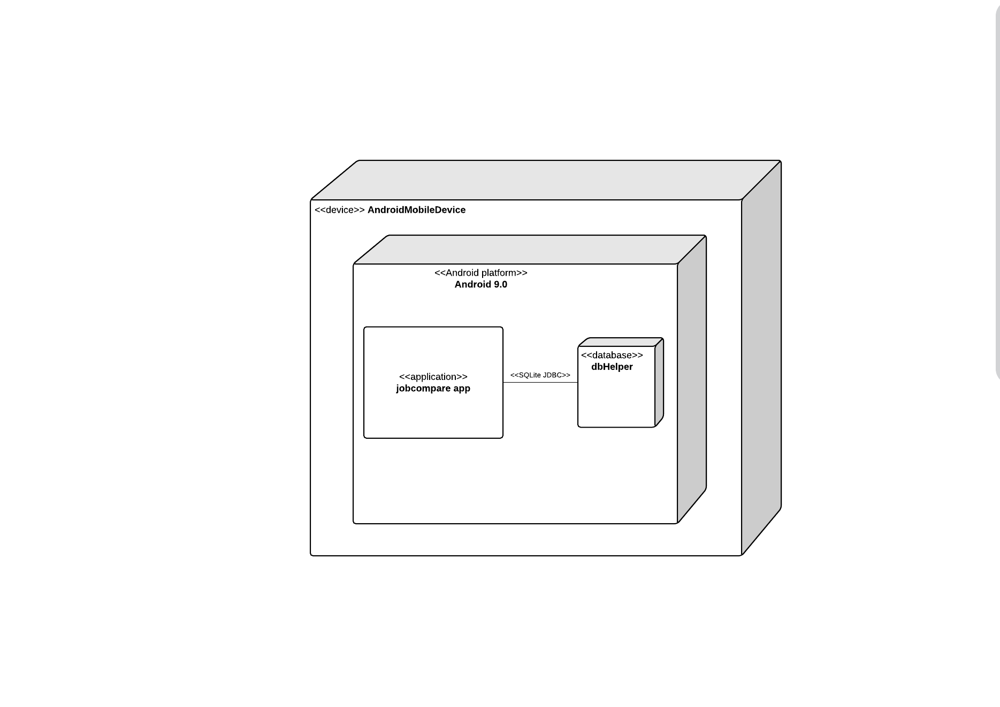
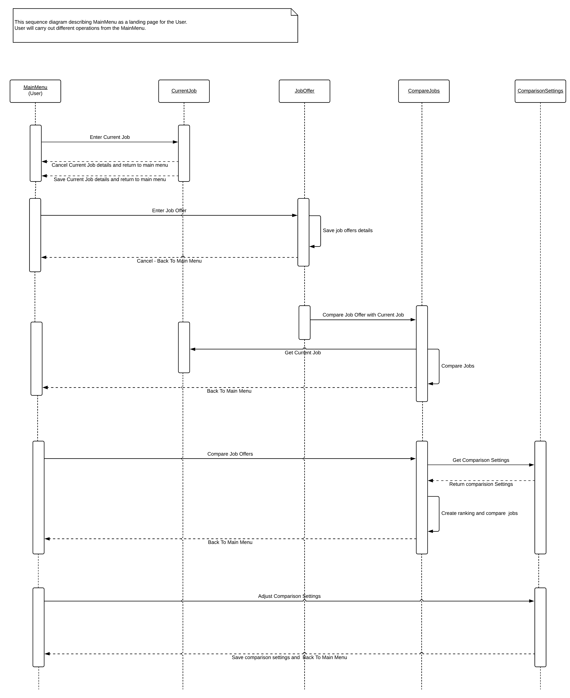
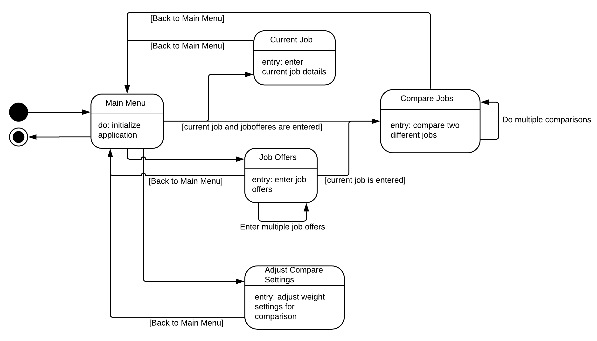

# Design Document

**Author**: 6300Fall20Team030

## 1 Design Considerations

### 1.1 Assumptions
This application is designed with the following assumptions in mind:
* User is operating on an Android device.
* Utility classes will be used to represent money.
* The application will be in English.
* The device will not maintain cross session state.
* User will not have to sign in or create an account to use the application.

### 1.2 Constraints
This application is designed with the following constraints in mind:
* The application will not keep track of information from another session so if the user exits out of application, they will have to enter information again.
* There is no way to edit or delete job offers.
* The user can edit the current job multiple times, but cannot delete it.
* When adding the current job or a job offer, all fields are mandatory for the job details to be saved.
* User must have an Android phone and have knowledge about how to use it.

### 1.3 System Environment
* Operating system: Android
* Environment: Smartphone application
* Platform: Android SDK
* Hardware: Android phone

## 2 Architectural Design
The architecture provides the high-level design view of a system.

### 2.1 Component Diagram
The component diagram shows the various components and how each are connected in the system. It shows logical and functional aspects by congregating related functionalities together as one component.

### 2.2 Deployment Diagram
The deployment diagram shows how different components of the system are deployed in hardware devices.

## 3 Low-Level Design
The low-level design shows the internal structure for each of the system components.

### 3.1 Class Diagram
The UML class diagram describes the different classes of the system as well as the relationships they have with each other, methods that each class holds, and attributes of each class.

### 3.2 Other Diagrams
This includes the sequence and state diagrams, which describes the possible flows of actions through the system and the different states that the system can be in at any moment.

## 4 User Interface Design
The UI design shows the format and layout of the system's user interface. This is what the user will see in each step of the application.

