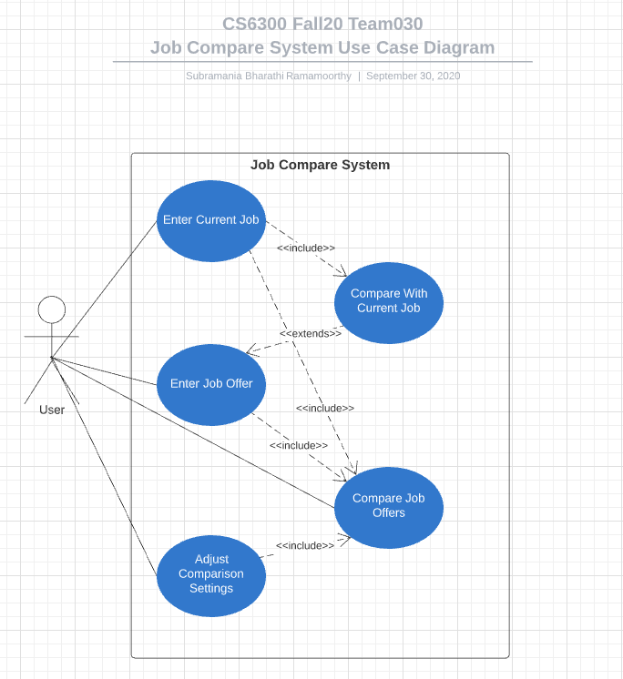

# Use Case Model

Use case diagram overview the usage requirements for the Job Compare system. These are useful for actual development and the use cases provide significantly more value because they describe the actual requirements with clear flow of events. The use case diagram is below for the Job Compare system.

**Author**: 6300Fall20Team030

## 1 Use Case Diagram

### Actors
  - ***User***

  is the only actor in the Job Compare system playing an ***external role*** in relation to the system.

### Use Cases
  - ***Enter Current Job***
  - ***Enter Job Offer***
  - ***Adjust Comparison Settings***
  - ***Compare Job Offers***

  are the use cases representing the functions or operations taking place in the Job Compare serving the ***User***
  - ***Compare With Job Offer***

  extends the ***Enter Job Offer*** use case because the ***User*** might compare the Job Offer that he/she entered with the Current Job or not.

## 2 Use Case Descriptions

### Enter Current job
- *Requirements:* This use case allows the user to enter the current job details.
- *Pre-conditions:* None
- *Post-conditions:* None
- *Scenarios:*
  - The user opens the app and selects **EnterCurrentJob** button from the main menu.
  - The user enters the details of the current job.
  - The user is provided a choice to either **Save** or **Cancel** the current job details.
  - If the user chooses **Save**, then the current job details are saved and the system exits to the main menu (use case ends).
  - If the user chooses **Cancel**, then the current job details are not saved and the system exits to the main menu (use case ends)

### Enter Job Offer
- *Requirements:* This use case allows the user to enter the details of a job offer.
- *Pre-conditions:* None
- *Post-conditions:* None
- *Scenarios:*
  - The user opens the app and selects **EnterJobOffer** button from the main menu.
  - The user enters the details of the job offer.
  - The user is provided a choice to either **Save** or **Cancel** the job offer details.
  - If the user chooses **Save**, then the current job details are saved and the user is given choices to make 3 possible alternate flow of events.
    - Alternate Event#1: **Enter Another Job Offer**
      In this event, the system goes back to the **EnterJobOffer** use case.
    - Alternate Event#2: **Compare With Current Job**
      In this event, the system compares the job offer that is recently entered with the current job, if the current job exists.
    - Alternate Event#3: **Return to Main Menu/Cancel**
      In this event, the system goes back to the main menu (use case ends)
  - If the user chooses **Cancel**, then the system exits to the main menu (use case ends)

### Adjust Comparison Settings
- *Requirements:* This use case allows the user to adjust the comparison settings.
- *Pre-conditions:* None
- *Post-conditions:* None
- *Scenarios:*
  - The user opens the app and selects **AdjustComparisonSettings** button from the main menu.
  - The user adjusts the comparison settings.
  - The user is provided a choice to either **Save** or **Cancel** the settings.
  - If the user chooses **Save** or then the settings are saved and the system exits to the main menu (use case ends).
  - If the user chooses **Cancel**, then the settings are reverted to default values and system exits to the main menu (use case ends)

### Compare Job Offers
- *Requirements:* This use case allows the user to compare two job offers (including the current job).
- *Pre-conditions:* At least 2 job offers or 1 current job and 1 job offer must be entered by the User before this use case is run.
- *Post-conditions:* None
- *Scenarios:*
  - The user opens the app and selects **CompareJobOffers** button from the main menu.
  - The user selects two job offers (including current job) from the list of job offers and clicks on **CompareJobs** button to trigger the comparison.
  - Then the user is given choices to make 2 possible alternate flow of events.
    - Alternate Event#1: **Perform Another Comparison**
      In this event, the system goes back to the **CompareJobOffers** use case.
    - Alternate Event#2: **Return to Main Menu/Cancel**
      In this event, the system goes back to the main menu (use case ends)
  - If the user chooses **Cancel**, then the comparison action is not performed and the system exits to the main menu (use case ends)
