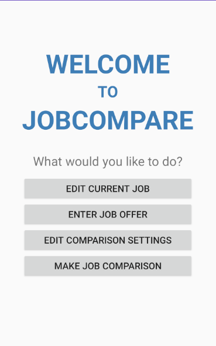
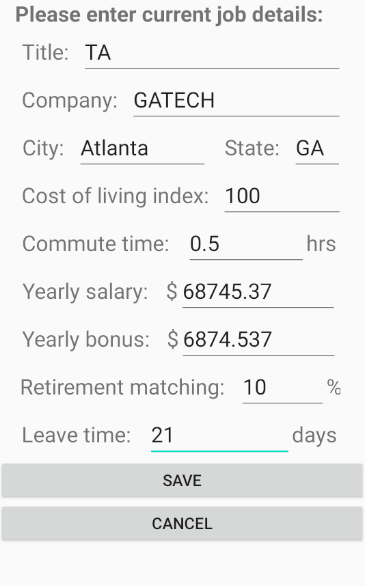
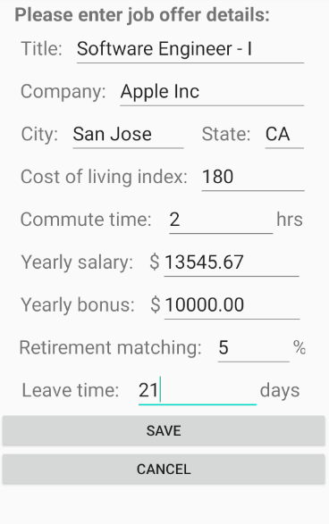
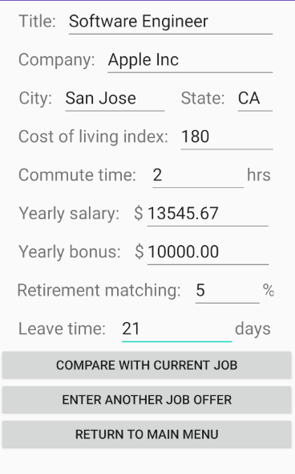
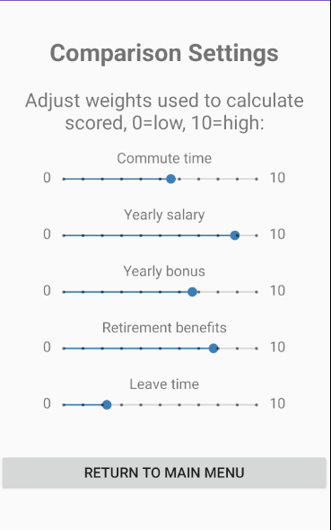
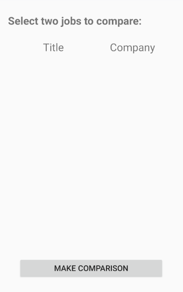

# JobCompare6300
## Introduction
JobCompare is an Android application that allows a user to make comparisons between two job offers or between a job offer and their current job. The user will have the option to adjust weights used in score calculation; these weights are yearly salary, yearly bonus, retirement benefits, leave time, and commute time.

#### What devices does the mobile app support?
The app can be installed on any mobile device that has the Android (mobile phone) operating system (Android 9.0 Pie or later).

## How it works?
Upon launching the app, the user is shown a **Main Menu** providing four actions that the user could take:
* **EDIT CURRENT JOB** - allows the user to enter (if the current job doesn't exist) or edit the previously inputted current job.
* **ENTER JOB OFFER** - allows the user to enter a job offer and upon saving, also provides the user the options to compare directly with current job or enter another job offer
* **ADJUST COMPARISON SETTINGS** - allows the user to adjust the weights of the calculation settings such as salary, commute time, leave time, bonus, and benefits.
* **MAKE JOB COMPARISON** - allows the user to select two jobs from a list of all jobs (including current job and all inputted job offers) and view a comparison between the two jobs

### Current Job
In the **Current Job**, the user is shown a form to enter Title, Company, City, State, Cost of Living Index, Salary, Benefits and Commute Time. The user can then either **Save** the details or **Cancel**.  Both operations will take the user back to the **MainMenu** screen. Upon saving, the current job details are stored in the database and it is displayed to the user for further editing if the user chooses to edit the current job.

### Job Offer
In the **Job Offer**, the user is shown a similar form to the one shown in **Current Job** to enter the Title, Company, City, State, Cost of Living Index, Salary, Benefits and Commute time. The user has the option to **Save** or **Cancel**. Upon **Cancel** the user is taken back to the **MainMenu**. On **Save**, the job offer is stored in the database and the saved job offer is displayed. At the point the user can choose from the below options.
* **COMPARE WITH CURRENT JOB** - When this option is selected, the app compares the job offer entered with the current job for all the attributes such as Title, Company, City, State, Cost of Living Index, Salary, Benefits etc.
* **ENTER ANOTHER JOB OFFER** - When this option is selected, the app takes the user back to the Job Offer screen to enter the details of another job.
* **RETURN TO MAIN MENU** - This option takes the user back to the Main Menu.

### Comparison Settings
This screen shows the different weight settings namely Commute Time, Salary, Bonus, Benefits and Leave time. The user can then use the slider to adjust the value ranging from 1 to 10 for each setting with 1 as the low setting value and 10 as the high value setting. The weights are used to calculate the 'jobscore' for each job offer and the current job. The score will be used to generate a ranked list of jobs for the user to pick from when selecting jobs to compare.

### Make Job Comparison
This screen lists the various job offers including the current job that user entered. The list is sorted based on the ranking for each job with highest ranked job at the top of the list. The ranking is based on the 'jobscore' which is calculated using the adjusted weights of the different settings.

From the list, the user needs to select at least 2 entries to trigger a comparison by clicking on the **MAKE COMPARISON** button. The **MAKE COMPARISON** button will be disabled if more than 2 entries are selected. Upon clicking the **MAKE COMPARISON** button, the app displays the comparison between the selected jobs for all the attributes such as Title, Company, City, State, Cost of Living Index, Salary, Benefits etc.

The user is then provided with the choice to **MAKE ANOTHER COMPARISON** or **RETURN TO MAIN MENU**

##### Input Validation
Each input field of the user entry screen for Current Job and Job Offer are validated for correct entries. Incorrect entries will be flagged and the user has to correct the wrong entries before saving the details.

## App Overview

The JobCompare6300 is a multi-screen app and below are the images of the different screens of the app. The images are sequenced as per the typical usage of the app.

